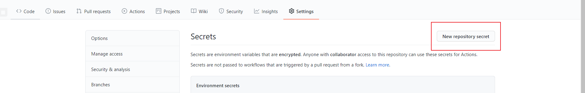
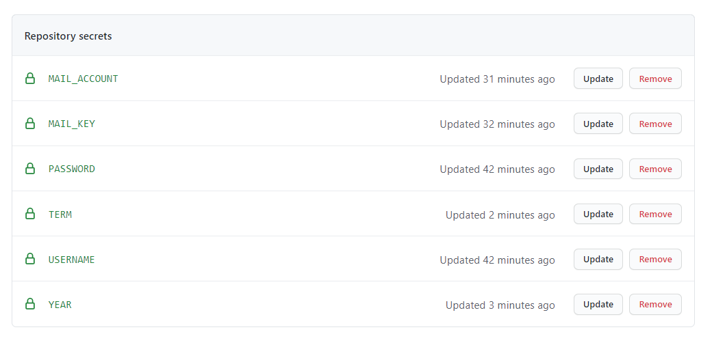
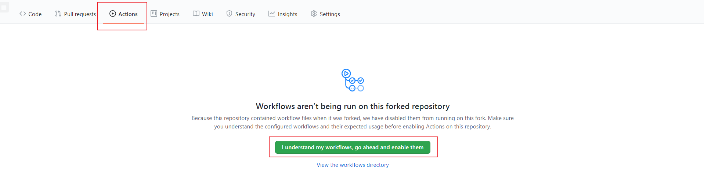
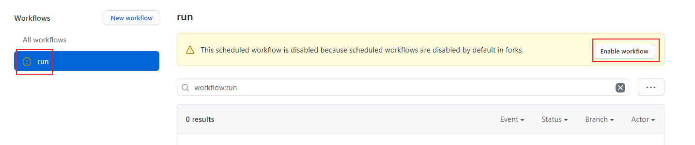

[](https://app.fossa.com/projects/git%2Bgithub.com%2Fyimo0908%2FNSMC_score?ref=badge_shield)

---

## 使用方法

### GithubAction

1. 点击项目右上角的Fork，Fork此项目

2. 到自己Fork的项目点击Setting → Secrets → New repository secret 

<details><summary>根据折叠内容，增加6个secret</summary>

Name填写`USERNAME`，Value填写 教务系统登录账号（通常为学号）  

Name填写`PASSWORD`，Value填写 教务系统登录密码  

Name填写`MAIL_ACCOUNT`，Value填写 QQ邮箱地址（`QQ号@qq.com`）  

Name填写`MAIL_KEY`，Value填写 [POP3/SMTP邮箱授权码](https://service.mail.qq.com/cgi-bin/help?subtype=1&id=28&no=1001256)    

Name填写`TERM` ，Value填写 要查询的学期（如`2020-2021-1`）
</details>

3. 点击`action`，再点击`I understand my workflows,go ahead and enable them`→`run`→`Enable workflow`即可激活自动运行
    默认在1月.2月.6月.7月每周一中午12:00自动查询并发邮件，可自行修改

  

  

---

## Q&A

```
Q：我会偷取你的个人信息吗？
A：不会，个人信息全部存在secrets里，只能自己改（看都看不到）
```
```
Q：Action那里打红色的叉是为什么？
A：原因有很多。
	1. 请先确定自己的5个secrets全部正确，Term的中间那个-请在英文状态下输入。
	2. 尝试点进红叉，点击右上方的Re-run jobs。等待其运行即可。
如果依然报错，请点进红叉，点击左边的run，展开右边红色打叉的部分。截图，并发送至miqoteyimo@qq.com
```

---


## License
[](https://app.fossa.com/projects/git%2Bgithub.com%2Fyimo0908%2FNSMC_score?ref=badge_large)
